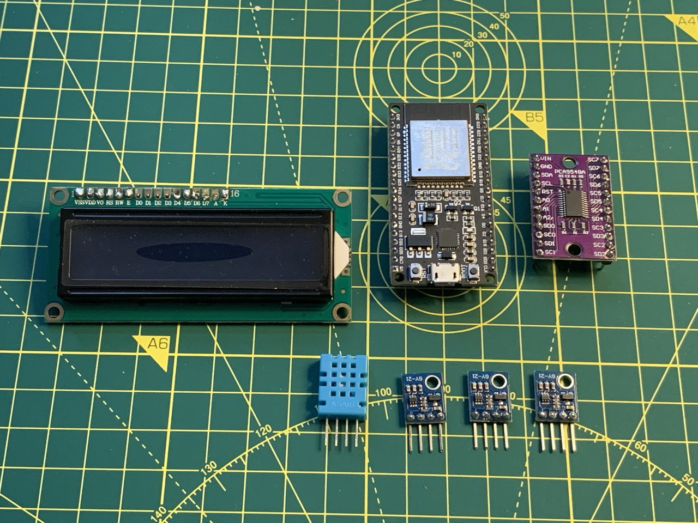
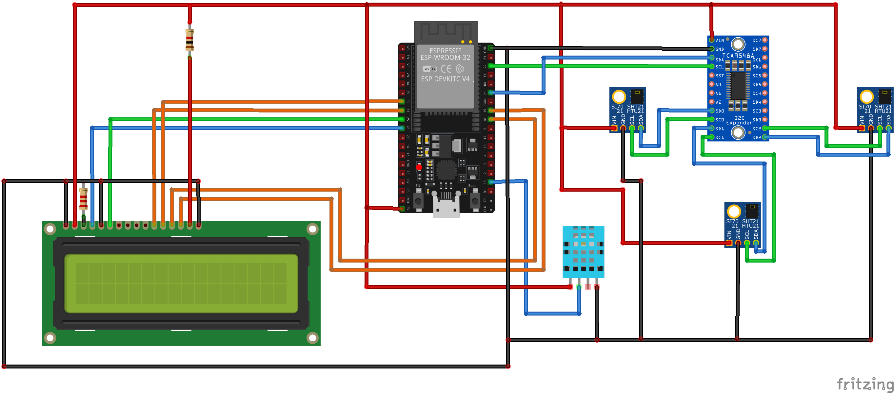
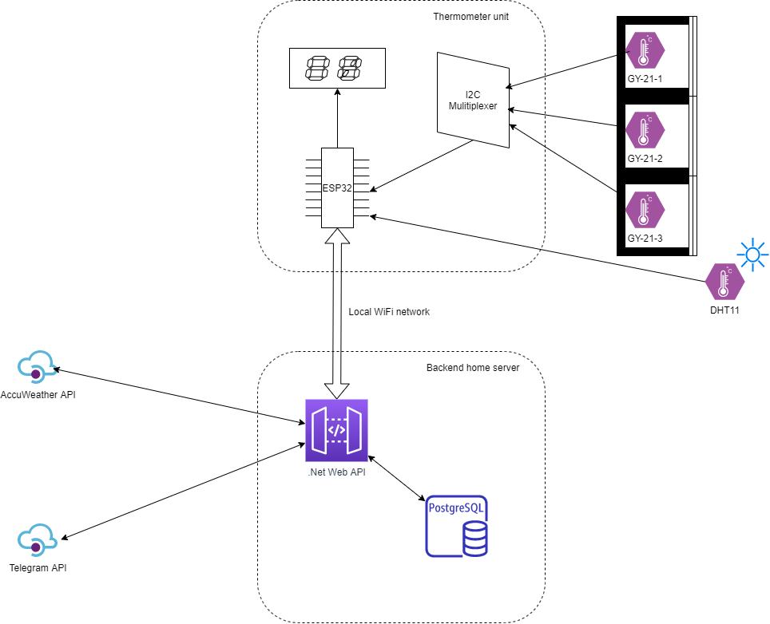

# Home Weather Station

An ESP32 based home weather station which measures the current temperature, fetches hourly weather forecast and shows everything at the LCD display.

---

## Project Overview

The **Home Weather Station** uses an ESP32 microcontroller to collect and display data. A 16x2 LCD shows:

- Temperature and humidity in three rooms of my apartment.
- Outdoor temperature and humidity.
- Hourly weather forecasts (e.g., "Sunny," "Rainy," or "Cloudy").

The system integrates hardware, a custom backend, and third-party APIs to ensure seamless functionality.

> TODO: Ready device with screen Picture placeholder

---

## Hardware Components

### Sensors and Connectivity

The system collects environmental data using four sensors:

1. **DHT-11 Sensor:**

   - This sensor is connected directly to the ESP32 via a GPIO pin and placed outside the apartment window to measure outdoor temperature and humidity.

2. **Three GY-21 Sensors:**
   - These sensors monitor indoor conditions in three rooms.
   - All GY-21 sensors share the same I2C address, which typically causes a conflict when connecting them to the same bus.

### I2C Multiplexer TCA9548A

To resolve the address conflict of the GY-21 sensors, the system uses the TCA9548A I2C multiplexer. This device allows the ESP32 to switch between its ports, enabling communication with each sensor sequentially. Here's how it works:

- The multiplexer creates 3 independent I2C channels.
- The ESP32 activates one channel at a time, isolating the selected sensor.
- Data from all three GY-21 sensors can be read sequentially without interference.

The TCA9548A is crucial for enabling multiple identical devices to coexist on a single I2C bus, making it an essential component in this project.

### Display

The **16x2 LCD screen** serves as the user interface, showing real-time data such as:

- Indoor and outdoor conditions.
- Current weather forecast.  
  The clear and simple display ensures the station is easy to read at a glance.

### Enclosure

To house the components, I built a custom enclosure out of Lego bricks. This design offers:

- **Protection:** Safeguards the ESP32, multiplexer, and display from damage.
- **Flexibility:** Allows easy access for upgrades or repairs.
- **Aesthetic Appeal:** Adds a fun and personalized touch to the project.

The sensors are connected to the ESP32 using old patch cables, which provide a reliable and flexible way to extend their range.

### Connection scheme

---

## Software Architecture

### ESP32 Firmware

The ESP32 is the brain of the operation. It communicates with the backend over WiFi and performs the following tasks:

1. **Data Collection:** Reads sensor data at regular intervals.
2. **Data Transmission:** Sends the collected data to the backend using a **POST** request every 6 hours.
3. **Forecast Retrieval:** Requests hourly weather forecasts from the backend via a **GET** request and displays them on the LCD.

The firmware is designed to be efficient and robust, ensuring smooth operation even over extended periods.

### Backend System

The backend is a **.NET Web API** application hosted on a local Linux server. It manages three main tasks:

1. **Storing Sensor Data:**

   - A POST endpoint receives data from the ESP32 and stores it in a PostgreSQL database. This creates a historical log of temperature and humidity readings for future analysis.

2. **Providing Hourly Forecasts:**

   - A GET endpoint retrieves hourly forecasts from the **AccuWeather API** and returns them to the ESP32.
   - By leveraging AccuWeather's free tier, the system stays within the 50 requests per day limit while maintaining accuracy.

3. **Sending Daily Summaries to Telegram:**
   - A scheduled job runs every morning to:
     - Fetch the latest sensor readings from the database.
     - Retrieve a 12-hour weather forecast from AccuWeather.
     - Compile this data into a summary message.
     - Send the message via the **Telegram Bot API** to a subscribed channel.

> TODO: Telegram screenshot placeholder

This integration ensures that I get an automated weather summary on my phone every morning.

---

## Code and deployment

- [Here is the Platform IO project with sketch for ESP32](./Esp32/)
- [Here is the backend .net project](./backend/)
- [Here is a small "HowTo" for creating a Telegram bot and using it via API](./backend/telegram.md)
- [Here is some instructions how to set up a home server using Linux](./backend/deploy.md) (In my case this is a Raspberry Pi 4 board computer)

---

## Daily Benefits

The **Home Weather Station** has become an invaluable tool in my daily life:

- **Real-time Monitoring:** The LCD provides up-to-date information about the conditions inside and outside my apartment.
- **Hourly Forecasts:** Help me plan activities based on expected weather changes.
- **Morning Summaries:** A Telegram notification delivers a convenient summary of the day’s conditions and forecast.

These features make the station both practical and easy to use.

## Final Thoughts

The **Home Weather Station** has been a rewarding journey into the world of IoT. Combining hardware and software taught me new skills and gave me a practical tool for my everyday life. Whether you’re an IoT enthusiast or looking for a new DIY challenge, I hope this inspires you to build something similar.
